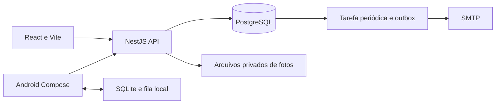

# Arquitetura

## Visão geral

A solução tem uma API central e dois clientes. As regras patrimoniais existem no backend; a interface nunca decide sozinha se uma mudança de estado é válida.

## Backend

`domain/model.ts` descreve os registros e `domain/rules.ts` contém regras puras. `persistence/schemas.ts` mapeia essas estruturas em EntitySchemas do TypeORM. Essa escolha evita classes com comportamento misturado à persistência e permite ler tipos e regras separadamente.

`assets/` implementa o ciclo patrimonial, `inventory/` a conferência e a sincronização, `imports/` a prévia e aplicação de planilhas, `files/` as fotos, `notifications/` as tarefas. O controlador HTTP valida entradas com Zod. O guard autentica, consulta a situação atual do usuário e autoriza a operação. A documentação de exemplos complementa o Swagger.

Alterações relevantes e histórico são gravados na mesma transação. Bloqueio de linha protege o ativo durante mudanças; o cliente informa `expectedVersion`. Se outro colaborador alterou o registro, a API responde 409 em vez de sobrescrever silenciosamente.

A reserva mantém o ativo em D. Um índice parcial impede reservas simultâneas. A mudança automática de prazo verifica novamente status e reserva sob a mesma trava usada por operações humanas.

## Web

`app-state.ts` contém carregamento e ações comuns. `features/` separa as telas por função. `api.ts` concentra transporte autenticado, tipos da interface e download de arquivos. O token fica no `sessionStorage`, limitado à sessão da aba. A autorização visual facilita a navegação; a autorização efetiva está na API.

## Android

`Api.kt` concentra chamadas; `Session.kt` protege o token com Android Keystore. `LocalStore.kt` contém snapshots e a fila SQLite. `SyncWorker.kt` envia pendências quando há rede. `SyncPolicy.kt` distingue reenvio, login e revisão humana. `BarcodeCamera.kt` isola câmera e reconhecimento. A tela Compose guia a preparação online e coleta offline.

O modelo de reconhecimento de barras é embarcado, sem depender de baixar o reconhecedor na sala. O inventário precisa existir no servidor antes da coleta offline. Fotos ficam no armazenamento privado do aplicativo até envio. O usuário que coletou deve autenticar novamente para sincronizar suas próprias pendências.

## Infraestrutura adaptável

| Necessidade                                 | Configuração/ponto de alteração                                                  |
| ------------------------------------------- | -------------------------------------------------------------------------------- |
| PostgreSQL local ou gerenciado              | `DATABASE_URL`, opções do DataSource para TLS conforme provedor                  |
| API em máquina, contêiner ou cloud          | `PORT`, origem web, proxy e endereço acessível pelos aparelhos                   |
| Portal estático                             | Artefato `web/dist`, `VITE_API_URL` no build                                     |
| Fotos em volume/local ou serviço de objetos | `FilesService` e anexos em `JobsService`; metadados separados no banco           |
| E-mail corporativo ou serviço SMTP          | Variáveis SMTP e destinatários parametrizados                                    |
| Agendamento interno ou externo              | `JOBS_ENABLED=false`; execução administrativa por `/jobs/run`                    |
| Celular pessoal ou corporativo              | Mesmo APK, URL configurável; distribuição e política de acesso escolhidas depois |
| Login institucional futuro                  | `AuthService` e emissão/validação de sessão; perfis locais permanecem            |

Não há Kubernetes, Redis ou microsserviços obrigatórios. A outbox usa PostgreSQL e a fila mobile usa SQLite. O projeto pode ser adaptado em um prompt futuro com mudanças concentradas nesses pontos.

## Tempo e entrega

Instantes do servidor usam `timestamptz`. Datas de incorporação são datas civis. A coleta mobile preserva `observedAt`, mas a ordem da auditoria usa o instante de aplicação no servidor. O prazo inicial é 20 dias corridos de 24 horas, com comparação estrita `>`; não são dias úteis.

Notificações têm entrega pelo menos uma vez. Há uma janela inevitável entre aceitação pelo SMTP e confirmação no banco: em falha nesse momento o e-mail pode ser reenviado. O `Message-ID` é estável para ajudar a identificar duplicatas. A mudança patrimonial não é revertida se o SMTP estiver indisponível.
