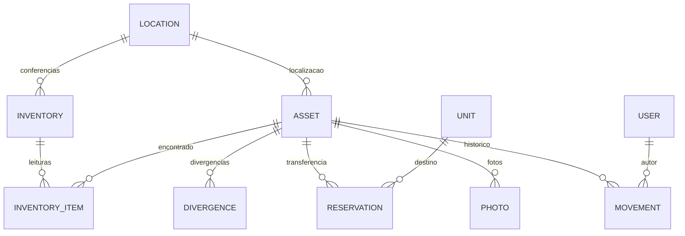

# Modelo de dados

A migration inicial é a autoridade do esquema. `synchronize` permanece desabilitado. Não altere o banco manualmente para fazer uma mudança permanente de funcionalidade.

| Tabela            | Conteúdo e integridade                                             |
| ----------------- | ------------------------------------------------------------------ |
| `users`           | Nome, e-mail único, hash de senha, perfil e acesso ativo           |
| `locations`       | Código único, descrição, prédio, andar, observação e situação      |
| `units`           | Código único, nome, e-mail e situação                              |
| `assets`          | Campos oficiais, status, localização, condição, versão e datas     |
| `reservations`    | Ativo, destino, solicitante e etapas do transporte                 |
| `movements`       | Antes/depois, operação, autor, justificativa e instante            |
| `inventories`     | Localização, responsável, estado e ativos esperados no início      |
| `inventory_items` | Uma conferência por ativo e sessão, resultado e instante observado |
| `divergences`     | Tipo, descrição encontrada, localização observada e resolução      |
| `photos`          | Metadados privados, vínculo ao ativo e opcionalmente à divergência |
| `settings`        | Prazo e listas de destinatários                                    |
| `outbox`          | Notificação pendente/enviada, tentativas e erro mais recente       |
| `import_batches`  | Prévia imutável em JSON, versões esperadas e decisões aplicadas    |
| `sync_receipts`   | UUID de operação, autor, hash do payload e resultado já aplicado   |

`assets.patrimony` e `assets.uniqueCode` têm restrições únicas. Valores monetários usam `decimal(15,2)` e transitam como string para evitar arredondamento binário. `condition` aceita 1 a 5 ou null quando não avaliada. Chaves estrangeiras preservam relações; não há exclusão de ativos exposta na API.

## Histórico e exclusão

A API não oferece DELETE para ativos, fotos, movimentações ou inventários. Localizações, unidades e usuários são inativados. Ativos baixados continuam consultáveis e são recusados nos fluxos de alteração. O histórico não é uma proteção criptográfica contra administradores do banco; restrinja credenciais e acesso direto em produção.

## Migrations futuras

Crie uma classe `MigrationInterface` com timestamp novo, registre no DataSource e valide em banco descartável. Não edite uma migration que já foi aplicada em outra instalação. Acrescente coluna inicialmente nullable quando houver dados existentes, preencha dados e somente depois imponha restrições. O rollback de esquema pode remover dados: faça backup e planeje-o.

## Banco do aparelho

SQLite contém `snapshots` e `operations`. Cada operação tem UUID, usuário, inventário, ativo, payload, estado, erro e foto local. Pendências não são removidas ao sair da conta. A desinstalação ou limpeza dos dados Android remove tudo; o aplicativo desabilita backup automático para evitar restaurar tokens/fila em outro aparelho inadvertidamente.
